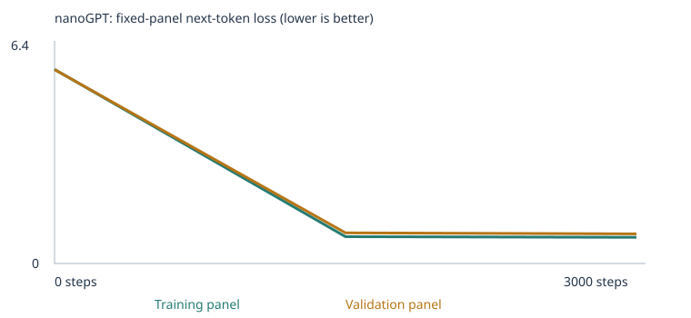
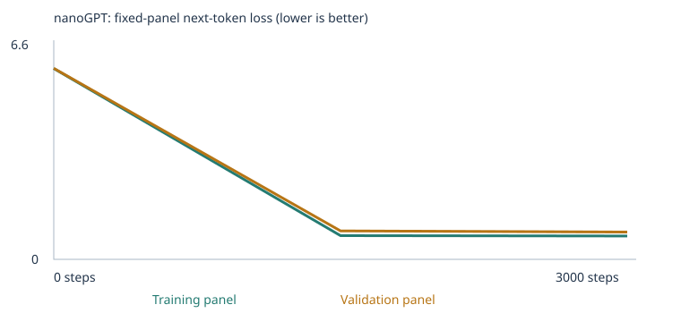

# Building a Custom LLM — what actually makes a tiny model learn

**Ricardo Díaz Ortiz · Class 4, From Zero to AI Agents, Fall 26**

Three training runs of Karpathy's nanoGPT (2 blocks, 4 heads, 64-number embeddings,
48-token context, whole-word tokens). Steps, learning rate, seed, split method, evaluation
panels and generation settings are identical in all three. **The corpus is the only
variable**, so anything that moves is attributable to the data.

| | A — starter | B — extension | C — hypothesis test |
|---|---|---|---|
| Notebook | [`custom_llm_starter.ipynb`](custom_llm_starter.ipynb) | [`custom_llm_extension.ipynb`](custom_llm_extension.ipynb) | [`custom_llm_experiment_c.ipynb`](custom_llm_experiment_c.ipynb) |
| Corpus | classroom only | + 434 passages, 3 categories | + 1,169 passages, 6 categories |
| Evidence | [`results/starter/`](results/starter) | [`results/extension/`](results/extension) | [`results/experiment_c/`](results/experiment_c) |
| **All-case score** | **20/48** | **28/48** | **34/48** |

Experiments A and B are the two the assignment requires. C is an optional third run that
exists to test a claim B produced — and it **refuted** that claim, which turned out to be
the most useful result of the three.

**The finding.** Whether this model learns a pattern tracks the **density of that pattern
in the training corpus** far more than the conceptual difficulty of the task. I predicted
the opposite and was wrong, with measurements to show it.

| Pattern | B density | B result | C density | C result |
|---|---:|---|---:|---|
| negation, 3-clause | 1.97% | **0/3** | **9.17%** | **2/3** |
| `X is inside Y . Y contains the ___` | 0.45% | correct | 0.41% | correct |
| `above` / `below` | 0.35% | correct | 0.30% | correct |
| `left` / `right` | 0.27% | correct | 0.24% | **lost it** (0.410 vs 0.405) |
| `a X is a Y` | 1.72% | 1/3 | 1.32% | **0/3** |
| `the opposite of X is ___` | — | — | 0.37% | 1/3 |

Patterns whose density rose improved; patterns whose density fell degraded, even though
their absolute passage counts never changed. Breadth cost depth.

---

## 1. My three choices

**Training steps: 3,000** and **learning rate: 0.001** in every run — the assignment's
suggested values, held fixed precisely so the corpus stays the only variable. One step
updates weights from 32 passages, so 3,000 steps is roughly twenty exposures per document.
Too large a learning rate overshoots and the loss oscillates; too small and 3,000 steps
end far short. The notebook's warmup means the first updates are much smaller than 0.001 —
the saved first update below uses `1e-05`.

**Corpus** is the choice that varies:

| Run | Corpus | Categories taught | Left untaught as control |
|---|---|---|---|
| A | classroom sentences only | none | all 8 |
| B | + `negation`, `spatial_relations`, `categories_and_analogies` | 3 | 5 |
| C | + `opposites`, `grammar`, `everyday_knowledge`; negation decorrelated and 4× larger | 6 | 2 (`reference`, `sequence`) |

I chose B's three categories by first **measuring** what the starter corpus could be scored
on at all — 24 of 48 — rather than guessing. All 24 extension cases failed as
`out_of_vocabulary`: a vocabulary problem, not a reasoning one.

### Corpus sources and permissions

Every added passage is **generated** by
[`build_extension_corpus.py`](build_extension_corpus.py) (run B) and
[`build_experiment_c_corpus.py`](build_experiment_c_corpus.py) (run C). Nothing is copied
from a third party, so there is no licensing question about publishing the extracted text,
manifests or weights.

```bash
python build_extension_corpus.py      # reproduces run B's corpus
python build_experiment_c_corpus.py   # reproduces run C's corpus
```

`corpus/` is Git-ignored, but the complete extracted text ships in each run's `corpus.txt`
([A](results/starter/corpus.txt) · [B](results/extension/corpus.txt) ·
[C](results/experiment_c/corpus.txt)) with per-file manifests
([B](results/extension/corpus_manifest.json) · [C](results/experiment_c/corpus_manifest.json)).

I used no PDFs. My original plan was a folder-only corpus of California land-use documents —
the Oakland Planning Code, OPR's General Plan Guidelines, design guidelines, an adopted
development agreement. I dropped it after measuring the evals: a corpus of zoning PDFs
would make nearly every case `out_of_vocabulary`, and the extension run is supposed to
teach specific eval categories, which a planning code does not. The land-use framing
survives in the *wording* of the teaching material — parcels, permits, districts,
setbacks — and the original plan is the proposed next experiment in section 10.

### Eval separation

| Check | A | B | C |
|---|---|---|---|
| Exact eval prompts found in training text | **0** | **0** | **0** |
| Eval explanation text found in training text | none | none | none |
| Classroom passages withheld before the split | 160 | 160 | 160 |
| Generated lines refused for reproducing a test item | — | 1 | 4 |
| `CORPUS_FOLDER` | `corpus/` | `corpus/` | `corpus/` |

The suite lives in `evals/`, never in `corpus/`, and its SHA-256 (`1d7c503f…c1c9e1d`) is
identical across all three runs. The generators refuse to emit any line that reproduces a
test item — B dropped one (it reproduced `lang_32` verbatim), C dropped four, including all
three negation test items, which decorrelation naturally produces. Both generators then
re-shuffle until the **whole assembled file** is clean, because `reject_eval_leakage`
matches against whole-file text and two individually safe lines can spell out a prompt when
adjacent.

Separation records: [A](results/starter/eval_separation.json) ·
[B](results/extension/eval_separation.json) · [C](results/experiment_c/eval_separation.json).

This is a normalized contiguous-prompt check, not a semantic one. **These public tests
guided what I chose to teach, and run C was designed after inspecting run B's results.**
That makes this a development benchmark. A claim about generalizing to unseen material
would need tests that never influenced the corpus.

---

## 2. What I predicted, and what actually happened

Predictions were written before each run: [A](docs_prediction_starter.md) ·
[B](docs_prediction_extension.md) · [C](docs_prediction_c.md), and each is the prediction
cell in its executed notebook.

| I predicted | What happened | |
|---|---|---|
| Exactly 24/48 scorable with the starter corpus | 24/48 | ✅ |
| Scorable rises to 33 in B | 33/48 | ✅ |
| B's five control categories stay at 0 scorable | all five did | ✅ |
| B's losses **higher** than A's, not lower | 0.778 vs 0.678 train | ✅ |
| `customer`'s neighbours become the nouns sharing its contexts | all five, ≥ 0.969 | ✅ |
| B's vocabulary about 281 types | **317** — I quoted a figure from an earlier draft of the generator | ❌ |
| B: pattern categories beat the knowledge category | spatial 3/3, categories 1/3, **negation 0/3** | ❌ |
| C: scorable rises to 42 | 42/48 | ✅ |
| C: `grammar` and `everyday_knowledge` score well | 3/3 and 3/3 | ✅ |
| C: `lang_46` still fails | it did, `bird` 0.119 vs `fish` 0.009 | ✅ |
| **C: negation still fails at 0–1 of 3** | **2 of 3** | ❌ **hypothesis refuted** |
| C: `opposites` scores well — it is an "easy" associative task | **1 of 3** | ❌ |

The last two are the point of the whole project, and section 6 works through them.

---

## 3. Run facts

| | A — starter | B — extension | C — hypothesis test |
|---|---|---|---|
| Corpus files | 0 | 3 | 6 |
| Unique passages | 4,592 | 5,026 | 5,761 |
| New passages added | — | 434 | 1,169 |
| Duplicates removed | 1,608 | 1,608 | 1,608 |
| Train / validation | 4,132 / 460 | 4,523 / 503 | 5,184 / 577 |
| Reserved eval passages | 160 | 160 | 160 |
| Distinct training types | 133 | 317 | 404 |
| Vocabulary size | 136 | 320 | 407 |
| Training UNK rate | 0.00% | 0.00% | 0.00% |
| Held-out UNK rate | 0.00% | 0.07% | 0.05% |
| Parameters | 111,872 | 123,648 | 129,216 |
| Steps completed | 3,000 / 3,000 | 3,000 / 3,000 | 3,000 / 3,000 |
| Interrupted | no | no | no |
| Training time | 15.5 s | 16.6 s | 17.3 s |
| Device / hardware | cpu · macOS-15.6.1-arm64 | cpu · macOS-15.6.1-arm64 | cpu · macOS-15.6.1-arm64 |

No run was interrupted and none errored. Python 3.12.14, PyTorch 2.14.0, Apple Silicon CPU.
Configs: [A](results/starter/config.json) · [B](results/extension/config.json) ·
[C](results/experiment_c/config.json). Vocabulary reports:
[A](results/starter/vocabulary_report.json) · [B](results/extension/vocabulary_report.json) ·
[C](results/experiment_c/vocabulary_report.json).

**The 509-type cap never binds.** 133, 317 and 404 distinct types — all below 509, so
nothing was pushed out of the vocabulary by my additions. I had wrongly worried about this
while planning. The held-out UNK rate never exceeds 0.07%.

The 90/10 split is by **deduplicated passage, not by source file**, so passages from the
same file sit on both sides. This does not test generalization to unseen documents. Exact
document lists: [A](results/starter/split.json) · [B](results/extension/split.json) ·
[C](results/experiment_c/split.json).

---

## 4. Losses





These are **fixed evaluation panels of at most 20 training and 20 validation documents**,
averaging non-padding next-token targets — small estimates, not full-corpus measurements.
All three runs use the same panel sizes. Every measured value:

| Step | A train | A val | B train | B val | C train | C val |
|---:|---:|---:|---:|---:|---:|---:|
| 0 | 4.9263 | 4.9275 | 5.7798 | 5.7739 | 6.0144 | 6.0213 |
| 1500 | 0.6821 | 0.7182 | 0.7992 | 0.9104 | 0.7475 | 0.8970 |
| 3000 | 0.6783 | 0.7061 | 0.7780 | 0.8817 | 0.7351 | 0.8597 |

History: [A](results/starter/history.json) · [B](results/extension/history.json) ·
[C](results/experiment_c/history.json). Per-step CSV:
[A](results/starter/training.csv) · [B](results/extension/training.csv) ·
[C](results/experiment_c/training.csv). Summaries:
[A](results/starter/training_summary.json) · [B](results/extension/training_summary.json) ·
[C](results/experiment_c/training_summary.json).

Step 0 differs between runs because loss at random initialization is about the natural log
of the vocabulary size: ln(136) = 4.91, ln(320) = 5.77, ln(407) = 6.01. The match confirms
the untrained model really is guessing uniformly.

**Higher loss does not mean a worse model here.** The three models predict over different
vocabularies, so the numbers are not comparable as a ranking. C carries a higher loss than
A and scores 14 more eval points.

The validation gap widens as the corpus diversifies — 0.028 in A, 0.104 in B, 0.125 in C —
which is consistent with the later corpora being genuinely more varied rather than more
memorizable.

---

## 5. Evals — all six result sets

48 fixed cases, unchanged across all three experiments, scored by whether the model gives
the correct choice the highest probability among four. Ties score zero. Unknown-word cases
are `out_of_vocabulary` and count as zero in all-case success.

| Experiment | Stage | Correct /48 | All-case | Scorable | Accuracy on scorable | Coverage |
|---|---|---:|---:|---:|---:|---:|
| A — starter | untrained | 9 | 18.8% | 24 | 37.5% | 50% |
| A — starter | final | 20 | 41.7% | 24 | 83.3% | 50% |
| B — extension | untrained | 7 | 14.6% | 33 | 21.2% | 69% |
| B — extension | final | 28 | 58.3% | 33 | 84.8% | 69% |
| C — hypothesis | untrained | 10 | 20.8% | 42 | 23.8% | 88% |
| C — hypothesis | final | **34** | **70.8%** | 42 | 81.0% | 88% |

Result sets: [A untrained](results/starter/language_evals/untrained) ·
[A final](results/starter/language_evals/final) ·
[B untrained](results/extension/language_evals/untrained) ·
[B final](results/extension/language_evals/final) ·
[C untrained](results/experiment_c/language_evals/untrained) ·
[C final](results/experiment_c/language_evals/final). Comparisons:
[A](results/starter/language_eval_comparison.json) ·
[B](results/extension/language_eval_comparison.json) ·
[C](results/experiment_c/language_eval_comparison.json).

### By category — trained models. Figures are `correct/total (scorable)`

| Category | Taught in | A | B | C |
|---|---|---|---|---|
| `negation` | B, C | 0/3 (0) | 0/3 (3) | **2/3 (3)** |
| `spatial_relations` | B, C | 0/3 (0) | **3/3 (3)** | 2/3 (3) |
| `categories_and_analogies` | B, C | 0/3 (0) | 1/3 (3) | 0/3 (3) |
| `opposites` | C | 0/3 (0) | 0/3 (0) | 1/3 (3) |
| `grammar` | C | 0/3 (0) | 0/3 (0) | **3/3 (3)** |
| `everyday_knowledge` | C | 0/3 (0) | 0/3 (0) | **3/3 (3)** |
| `reference` | never | 0/3 (0) | 0/3 (0) | 0/3 (0) |
| `sequence` | never | 0/3 (0) | 0/3 (0) | 0/3 (0) |
| `domain_context` | never | 8/8 (8) | 8/8 (8) | 8/8 (8) |
| `domain_place` | never | 8/8 (8) | 8/8 (8) | 8/8 (8) |
| `new_wording` | never | 4/8 (8) | 8/8 (8) | 7/8 (8) |

`reference` and `sequence` were never taught in any run and never moved off zero scorable
cases, in any run. That is the control working: gains came from data I added, not from the
model getting generally better.

Two things I did not engineer. `new_wording` improved from 4/8 to 8/8 in B despite being
untaught — more varied data made the model less brittle across phrasings, the closest thing
here to genuine generalization — and then slipped back to 7/8 in C. And the first 16 cases
score 16/16 in every run, but those prompts are the training frames with the last word
removed, so that is frame-learning, not comprehension.

---

## 6. The claim I made, and the experiment that refuted it

### What run B looked like

B taught three categories. Spatial relations went 3/3, categories 1/3, and **negation 0/3
despite receiving the most examples**. Probing B's trained model produced a striking result:

```
nora did not buy tea . she bought milk . nora bought  ->  rice .277 bread .264 tea .232 milk .219
iris did not buy tea . she bought milk . iris bought  ->  rice .278 bread .264 tea .232 milk .219
june did not buy tea . she bought milk . june bought  ->  rice .277 bread .265 tea .232 milk .219
nora did not buy milk . she bought bread . nora bought -> rice .278 bread .264 tea .232 milk .219
```

Identical to three decimals regardless of the buyer *or the goods named in the prompt*. In
that frame the model was not reading the context at all — it had learned one static ranking
of groceries and recited it.

### The claim

I formed a hypothesis: the model learns patterns whose answer is fixed by **position or
association**, and fails at patterns requiring it to **discriminate** which of two
same-category words in context was the corrected one. Supporting evidence looked strong —
`contains` was learned from only 30 passages while the buy frame failed with 59.

I predicted negation would stay at 0–1 of 3 in run C even with decorrelated, four-times-
larger data, and that the "easy" associative categories would score well.

### What run C actually showed

**Negation went to 2/3.** The task was learnable all along.

| Case | B | C |
|---|---|---|
| `the box is not red . it is blue . the box is ___` | green .414, **blue .062** → wrong | **blue .325**, yellow .276 → **correct** |
| `the door is not open . it is closed . the door is ___` | open .410, closed .351 → wrong | **closed .864** → **correct** |
| `ava did not buy tea . she bought milk . ava bought ___` | flat, milk .219 → wrong | still flat, milk .233 → wrong |

And `opposites`, which I called easy, scored **1/3**.

### The explanation that survives

Line up every pattern against how dense it is in its corpus and the picture is consistent:

| Pattern | B density | B | C density | C |
|---|---:|---|---:|---|
| negation, 3-clause | 1.97% | 0/3 | **9.17%** | **2/3** |
| `a X is a Y` | 1.72% | 1/3 | 1.32% | 0/3 |
| `contains` | 0.45% | correct | 0.41% | correct |
| `above`/`below` | 0.35% | correct | 0.30% | correct |
| `left`/`right` | 0.27% | correct | 0.24% | lost, 0.410 vs 0.405 |
| `the opposite of X is` | — | — | 0.37% | 1/3 |

Negation's density rose 4.7× and it went from total failure to 2/3. Every carried-over
pattern whose share of the corpus *fell* — because C's corpus is larger — got worse, even
though their absolute passage counts never changed. `opposites` failed not because it is
hard but because at 0.37% it is one of the thinnest patterns in the corpus.

**So the operative variable is pattern density, not task difficulty.** My "discrimination"
story was a plausible narrative fitted to one run; a second run with a written-down
prediction broke it.

Two residues the density story does not fully explain, which I am flagging rather than
explaining away:

1. **The buy frame is still flat in C**, even at high density. Its value set has four
   members and both candidates are groceries; the colour set that succeeded had four
   members too, but `lang_33`'s set has only **two** (`open`/`closed`) and it scored 0.864 —
   by far the most confident correct answer in the suite. Narrower choice sets appear to be
   learned much more strongly, which is a hypothesis for a fourth run, not a finding.
2. **`categories_and_analogies` got worse, not just weaker.** The embeddings say why:

```
`bird`   before: banana (0.361), purchase (0.259), corrected (0.238)
         after : tool (0.740), building (0.708), vehicle (0.668), sheep (0.658), tree (0.653)
```

`bird` sits next to `tool`, `building` and `vehicle` — the model learned a generic
"category slot" rather than the link from `salmon` to `fish`, so it fills the slot with
whichever class word is most frequent. My `KINDS` list contains five birds. Computed by
[`neighbors.py`](neighbors.py); cross-checked in `embedding-viewer.html`, which reports the
same figures for `above` (below 0.916, beside 0.674, inside 0.592) and a total movement of
0.818 in 64 dimensions. The viewer's map is a 3-dimension PCA projection; these neighbours
use the full vector space, which is why the picture and the numbers can disagree.

---

## 7. How this works, in the numbers from these runs

Every figure below is read from this repository's own saved artifacts: `tokenization.json`
([A](results/starter/tokenization.json) · [B](results/extension/tokenization.json) ·
[C](results/experiment_c/tokenization.json)) and `inspection.json`
([A](results/starter/inspection.json) · [B](results/extension/inspection.json) ·
[C](results/experiment_c/inspection.json)). The trace follows one word, `customer`,
through run A, whose 136-word vocabulary is small enough to inspect whole.

**A corpus is the only thing the model ever reads.** A corpus is the original text on which
the model is trained. The model can only know and say words that appear in this corpus.

It starts as random numbers with no pretrained knowledge. Long text is cut into passages of
at most 47 tokens at sentence boundaries, deduplicated, then split 90/10. Run C started from
7,369 chunks, 1,608 of them duplicates, leaving 5,761 unique. One real training passage:

```
today the school focused on lesson and the local professor .
```

**Tokens and token IDs are different things.** A token ID identifies a unique word, while a
token itself is the specific instance of that word in a passage. Each word has one token ID,
but the token can appear in many places.

That passage becomes these IDs, with `<BOS>` = 1 and `<EOS>` = 2 marking where the passage
starts and ends:

```
[1, 121, 118, 101, 42, 74, 61, 7, 118, 63, 88, 3, 2]
```

`the` appears twice and carries ID 118 both times. Tokens here are whole words and
punctuation — not characters and not sub-word pieces.

**Training is one guessing game, repeated.** The model is playing a game to predict what the
next word is. The right answer comes from the corpus itself — it is simply the next word in
the passage, so the answer key is the training text and nothing was labelled by hand. The
evals play no part in this; they are a separate exam the model never studies from.

Every passage becomes a column of input-and-answer pairs, the targets being the inputs
shifted left by one:

| input | target |
|---|---|
| `<BOS>` | today |
| today | the |
| the | school |
| school | focused |
| focused | on |

**An ID is a row number, nothing more.** The ID for `customer` changes between runs because
the vocabulary is rebuilt from scratch during each run. The ID carries no inherent meaning at
all; it is only the address the model uses to look up that word's row.

| Run | ID for `customer` | Vocabulary size |
|---|---:|---:|
| A | 28 | 136 |
| B | 85 | 320 |
| C | 86 | 407 |

**Each ID points at 64 numbers.** An embedding is a vector that represents the meaning of the
word. The numbers changed as the model refined the relationships between words.

```
before: [-0.0576, -0.0048,  0.0426,  0.0193,  0.0156, -0.0288,  0.0256,  0.0001, …]
after : [ 0.0366, -0.0182,  0.1330,  0.1060,  0.0630,  0.0189,  0.1523,  0.0929, …]
```

The largest single coordinate moved by 0.1616.

**The numbers become meaning through their neighbours.** The model worked out the
relationships between words simply by seeing which words occur together.

No individual number is interpretable. What matters is which other words end up pointing the
same way. Before training, `customer`'s nearest neighbour was `bus` at 0.213 — noise. After
3,000 steps:

| Neighbour | Cosine similarity |
|---|---:|
| `shopper` | 0.978 |
| `client` | 0.977 |
| `buyer` | 0.977 |
| `subscriber` | 0.971 |
| `consumer` | 0.970 |

Nobody told the model these words are related. They share the same contexts in the sentence
frames, and that alone put them together.

**Attention reads earlier words, never later ones.** The zeros in the top right mean that the
model is only looking at the words that come before, not the ones that come after. Without
that restriction the model could see the very word it is being asked to predict, so it would
score perfectly during training and learn nothing.

First head, first block, run A — every row sums to 1:

```
  [1.000, 0.000, 0.000]
  [0.606, 0.394, 0.000]
  [0.485, 0.423, 0.092]
```

**Scores become probabilities, loss, and a nudge.** The model assigns a probability to each
word and chooses the next word from those probabilities. It then compares its prediction to
the actual next word, and where it was wrong it adjusts so as to be less wrong next time. It
is constantly adjusting its weights in order to minimise loss.

For the prefix `the customer` in run A:

| Next token | Before training | After training |
|---|---:|---:|
| `reviewed` | 0.00711 | 0.17825 |
| `recommended` | 0.00643 | 0.17121 |
| `ordered` | 0.00624 | 0.16847 |
| `selected` | 0.00785 | 0.16344 |
| `compared` | 0.00621 | 0.15966 |
| `returned` | 0.00783 | 0.14275 |

Before training everything sits near 1/136 = 0.0074 — uniform guessing. After, six verbs hold
about 98% of the mass, and they are exactly the six the corpus uses in
`the {noun} {verb} the {product} after checking the price .`

Loss measures that surprise as a number. At step 0 it is ln(136) = 4.91, which is what
uniform guessing costs, and it fell to 0.678.

One real saved weight update, the first one recorded:

| | value |
|---|---|
| parameter | embedding of `customer`, coordinate 0 |
| value before | `-0.05759192` |
| gradient | `+0.00069259` |
| learning rate | `1e-05` (warmup — not yet 0.001) |
| value after | `-0.05760191` |
| net movement | `-9.99e-06` |

The gradient says which direction would increase the loss; the optimizer steps the opposite
way, scaled by the learning rate. That single step moved one of 111,872 numbers by about one
hundred-thousandth, and training is 3,000 such steps across every parameter at once.

**Temperature changes the sampling, not the model.** Temperature changes how random the model
acts. Low temperature makes it give safe words, while raising it lets the model explore more.
It applies at generation time only — the weights are identical at every setting, so nothing
about the model has been learned or changed by turning the dial.

Full output: [A](results/starter/temperature_comparison.json) ·
[B](results/extension/temperature_comparison.json) ·
[C](results/experiment_c/temperature_comparison.json).

| T | Sample from run B |
|---|---|
| 0.3 | `the report about the orange explains the juice in detail .` |
| 0.8 | `the customer selected the merchandise after checking the price .` |
| 1.2 | `a district contains the drill .` |

Low temperature sharpens the distribution and returns safe, high-frequency frames; high
temperature flattens it and lets unlikely tokens through — at 1.2 one sample loses its opening
article entirely and another mixes land-use vocabulary with a hardware noun. Same weights,
different sampling.

---

## 8. Samples over training

Same generation settings at every checkpoint. All saved samples, including garbled ones:
[A](results/starter/samples) · [B](results/extension/samples) · [C](results/experiment_c/samples).

**Untrained (step 0), run C** — no structure:

```
nurse software not helped willow linen animal orange orange asleep teacher uses teacher
during corridor late professor maple is waits square banana customer
```

**Final (step 3000), run C:**

```
the local taxi was mentioned in the journey report yesterday .
a review of interest helped us understand the different deposit .
a review of learning helped us understand the important lecturer .
a review of fruit helped us understand the important pear .
```

Most visible change happens between step 0 and step 1500; 1500 to 3000 barely moves, which
matches the loss curve flattening. What is **not** visible is any teaching material — every
final sample is a classroom frame, because classroom sentences are 84% of C's passages. The
model learned my patterns well enough to answer eval prompts about them, but not well
enough to produce them unprompted.

---

## 9. Chat interface

Two interfaces, both running trained weights from these experiments:

- **Notebook** — section 10 of each notebook, three turns with visible outputs, saved to
  `chat_transcript.json` ([B](results/extension/chat_transcript.json) ·
  [C](results/experiment_c/chat_transcript.json)).
- **Terminal** — `chat.py` against saved weights:

```bash
python chat.py --model results/experiment_c/model.pt --transcript my_chat.json
```

Run C's session (`model_sha256` `f199e83352d21f70`, 3,000 steps):

```
You: the opposite of cold is
Model: nurse .
You: the permit is not approved.it is
Model: denied . the permit is filed .
You: the design review board approved the variance
Model: the price .
Unknown words: board, variance
```

These three turns are the whole project in miniature. **Turn 2 works** — the negation
pattern fires correctly in land-use vocabulary, `not approved` → `denied`, then drifts on
the second clause. **Turn 1 fails** exactly as the density table predicts: `opposites` is
the thinnest pattern in the corpus at 0.37%, so the model falls back on classroom words and
answers `nurse`. **Turn 3** shows the vocabulary limit — `board` and `variance` are unknown,
so the model sees `<UNK>` and continues with an unrelated frame.

Run B's captured terminal session, for comparison:
[raw log](results/extension/chat_terminal_session.txt) ·
[transcript](results/extension/chat_terminal_transcript.json).

This is a tiny language model. It continues text rather than answering questions, each
prompt starts fresh with no memory, the context is 48 tokens, and any word outside the
407-entry vocabulary becomes `<UNK>`. Generating replies never updates weights and chat text
never enters the corpus.

> **Note for submission:** the notebook chat cells and the logs above are the interface
> evidence. If a literal PNG screenshot is wanted, open a notebook to section 10 and
> capture it.

---

## 10. One limitation and my next experiment

**Limitation.** The sharpest one is that my own explanations kept outrunning my evidence.
After run B I had a confident mechanistic story — the model cannot do discrimination tasks —
that a single further run with a written-down prediction destroyed. The corpus was the
problem, not the architecture. The lesson I would carry forward is that a plausible
narrative fitted to one run is worth very little, and that writing the prediction down
first is what makes the difference between an experiment and a rationalization.

Behind that sits a structural limitation: this benchmark guided the corpus, run C was
designed after reading run B's results, so these numbers measure development progress and
not generalization.

**Next experiment.** Hold the corpus size fixed and vary only **choice-set width**. The one
negation case that stayed flat at 9% density is the one whose candidates are four
interchangeable groceries; the case that scored 0.864 — the most confident correct answer
anywhere in the suite — has only two candidates, `open` and `closed`. I would generate
negation material with 2-, 3-, 4- and 6-member value sets at matched density and plot score
against set width. My prediction: accuracy falls sharply with width, and the buy frame's
failure is a choice-set effect rather than anything about groceries.

The land-use corpus I originally planned — Oakland Planning Code Title 17, OPR's General
Plan Guidelines, design review guidelines, an adopted development agreement — remains the
experiment after that, evaluated on perplexity over held-out planning text rather than on
this suite, which is the wrong exam for it.

---

## 11. Reproducing this

```bash
uv venv --python 3.12
uv pip install -r requirements.txt ipykernel nbformat numpy

# A — starter, empty corpus/
rm -f corpus/*.md && git checkout corpus/README.md
jupyter nbconvert --to notebook --execute --inplace custom_llm_starter.ipynb

# B — extension
python build_extension_corpus.py
jupyter nbconvert --to notebook --execute --inplace custom_llm_extension.ipynb

# C — hypothesis test
rm -f corpus/*.md && git checkout corpus/README.md
python build_experiment_c_corpus.py
jupyter nbconvert --to notebook --execute --inplace custom_llm_experiment_c.ipynb

# Tables and embedding neighbours
python summarize_runs.py results/starter results/extension
python neighbors.py results/experiment_c/checkpoint.json above bird customer
```

On Apple Silicon: a stock python.org Python 3.9 is an x86_64 build and PyTorch has no
current wheels for it. The `uv` venv above gets a native arm64 Python 3.12.

Helper scripts: [`build_extension_corpus.py`](build_extension_corpus.py) ·
[`build_experiment_c_corpus.py`](build_experiment_c_corpus.py) ·
[`configure_notebook.py`](configure_notebook.py) ·
[`summarize_runs.py`](summarize_runs.py) · [`neighbors.py`](neighbors.py).
Rerun the evals on saved weights with [`run_evals.py`](run_evals.py).
`checkpoint.json` holds initial and final embeddings for
[`embedding-viewer.html`](embedding-viewer.html); `model.pt` holds the full network for
inference. Neither is an exact training-resume file.

The model and the 48-case suite are unmodified from the
[sample project](https://github.com/pepealonso95/custom-llm); nanoGPT is Karpathy's, MIT
licensed — see [`NANOGPT_LICENSE`](NANOGPT_LICENSE).
